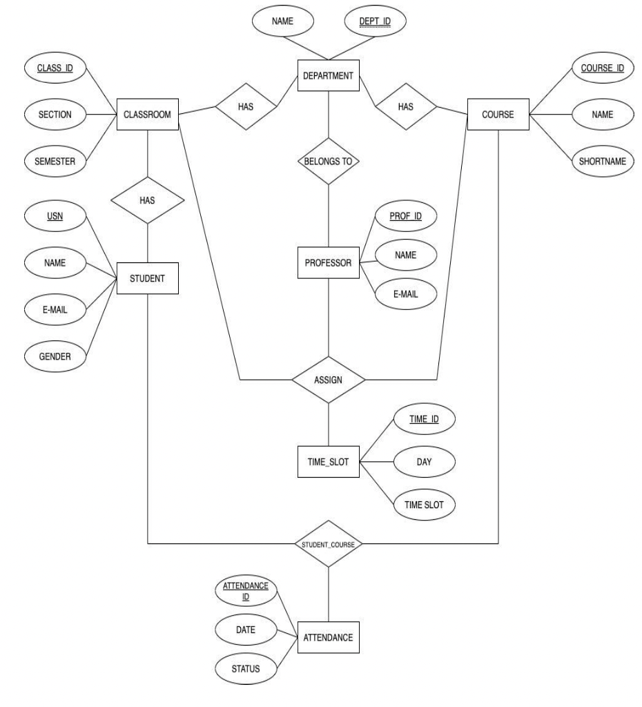
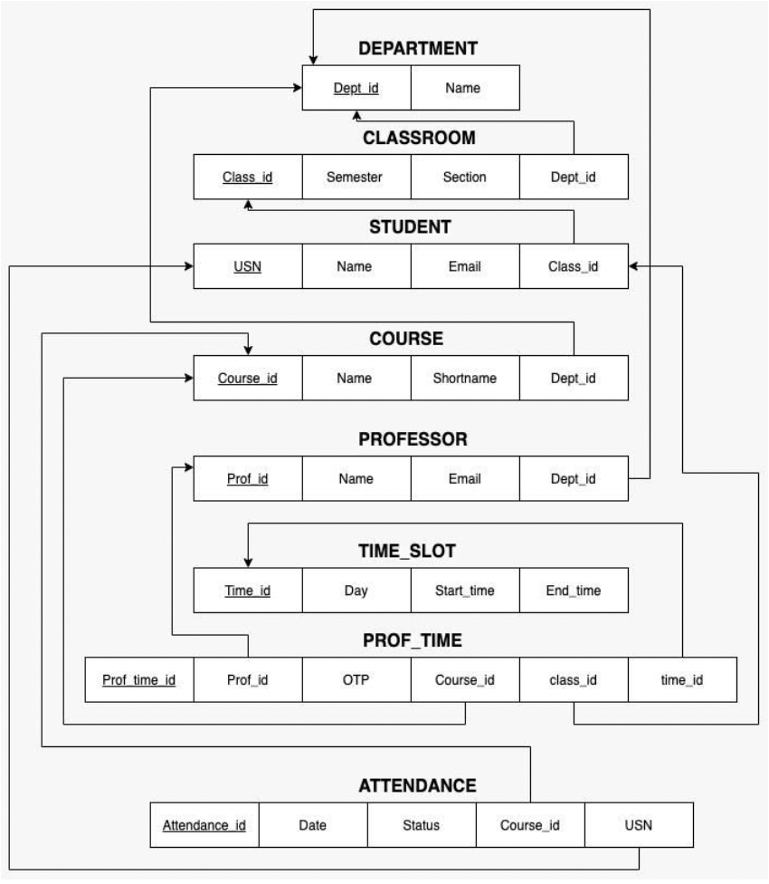

<h1 style = "text-align: center" >AttendeeGrab</h1>

The objective of this project is to give teachers a comprehensive and efficient tool for tracking student attendance. By utilizing our system, teachers will be able to take attendance quickly and easily, with the added benefit of having all relevant student information at their fingertips. This includes details such as student identification, name, mailing address, phone number, date of birth, and more.

Additionally, our system will provide students with the ability to track their own attendance records, including the number of classes attended and missed. This will allow them to stay informed about their academic progress and be aware of any topics they may have missed.

Overall, our project aims to streamline the process of managing student attendance and information for both teachers and administrators, making it a more efficient and effective task for all parties involved.

- <h2 style = "text-align: center" >ER DIAGRAM</h1>

  

- <h2 style = "text-align: center" >SCHEMA</h1>

  

- <h2 style = "text-align: center" >USER INTERFACE DESIGN</h1>

  <ul>
    <ul>
      <li><h3 style = "text-align: center" >Student login page</h1></li>
      

        
      

      <li><h3 style = "text-align: center" >Teacher login page</h1></li>
      

        
      

      <li>Bullet point 3</li>
    </ul>
  </ul>

